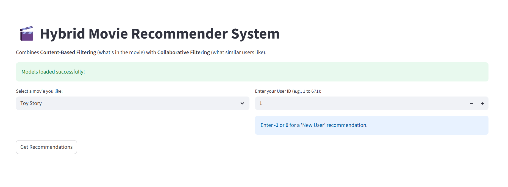
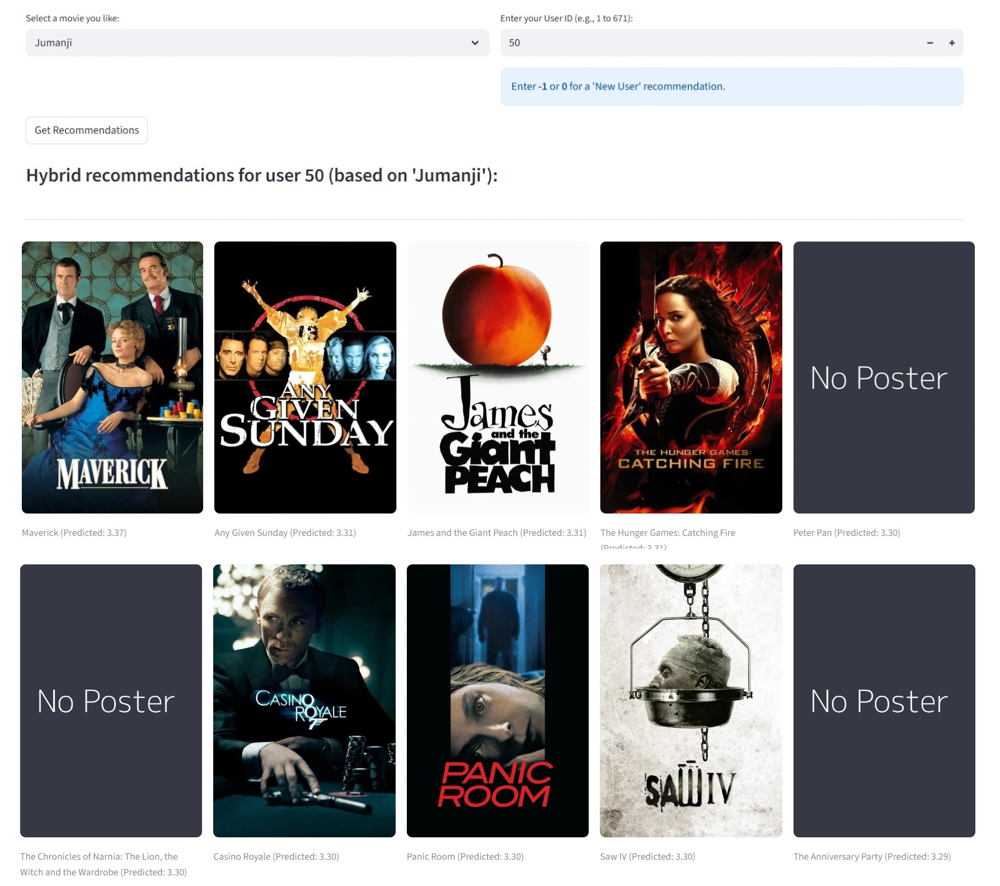
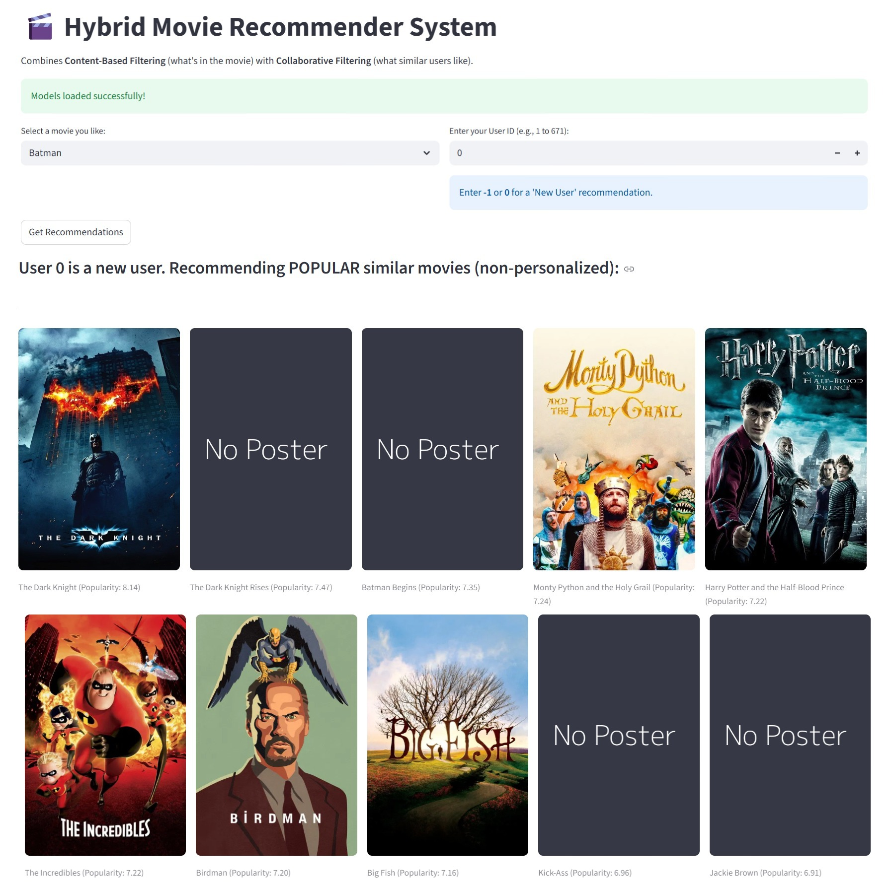

# 🎬 Hybrid Movie Recommender System

[](https://www.python.org/)
[](https://streamlit.io/)
[](https://scikit-learn.org/)

An intelligent movie recommendation engine that combines content-based and collaborative filtering to deliver personalized movie suggestions. Built with Streamlit and powered by machine learning algorithms including TF-IDF and Singular Value Decomposition (SVD).



## 🌟 Overview

This project implements a sophisticated hybrid recommendation system that leverages both content similarity and user behavior patterns to suggest movies. The system intelligently adapts its recommendation strategy based on whether you're a new or existing user, ensuring relevant recommendations for everyone.

### Demo Screenshots

**For Existing Users (Personalized Recommendations)**



**For New Users (Popularity-Based Recommendations)**



## ✨ Features

- **🎯 Hybrid Recommendation Engine:** Combines two powerful models:
  - **Content-Based Filtering (TF-IDF):** Analyzes movie metadata including plot, cast, director, genres, and keywords
  - **Collaborative Filtering (SVD):** Learns from user rating patterns to predict preferences
  
- **👤 Personalized Recommendations:** Tailored suggestions based on your historical rating behavior and preferences

- **🆕 Cold-Start Solution:** New users receive intelligent recommendations based on popular movies with similar content to their selection

- **🖥️ Interactive Web Interface:** Clean, responsive Streamlit UI for seamless user experience

- **🎨 Dynamic Visual Content:** Real-time movie poster fetching from TMDb API with elegant fallback placeholders

- **⚡ Performance Optimized:** Pre-computed models stored in pickle files and efficient caching mechanisms to minimize loading times

## 🤖 How It Works

The system employs a two-stage hybrid approach:

### Stage 1: Content-Based Filtering (Candidate Generation)

1. **Feature Engineering:** Each movie is represented by a "tags" corpus combining:
   - Plot overview (stemmed words)
   - Genres
   - Keywords
   - Top 5 cast members
   - Director name

2. **Vectorization:** Text data is transformed using `TfidfVectorizer` (max 5000 features) to create numerical feature vectors

3. **Similarity Calculation:** When you select a movie, the system computes **cosine similarity** against all other movies to find the top 100 most similar candidates

### Stage 2: Collaborative Filtering (Re-ranking)

1. **Matrix Factorization:** A user-item rating matrix is decomposed using **Truncated SVD** (50 components) to discover latent features

2. **Personalized Scoring:** The system predicts ratings for the 100 candidates specifically for your user profile

3. **Adaptive Strategy:**
   - **Existing Users:** Candidates are re-ranked using predicted ratings from the SVD model
   - **New Users:** Candidates are ranked by weighted popularity score (IMDb formula)

4. **Final Output:** Top 10 movies from the re-ranked list are displayed with posters and scores

### Recommendation Formula

**Existing Users (Hybrid):**
```
Score = SVD_predicted_rating(user, movie)
where the SVD model predicts ratings based on:
  - User's historical rating patterns
  - Similar users' preferences
  - Movie similarity in latent feature space
```

**New Users (Weighted Popularity):**
```
Score = (v/(v+m) × R) + (m/(v+m) × C)
where:
  v = number of votes for the movie
  m = minimum votes required (90th percentile threshold)
  R = average rating of the movie
  C = mean rating across all movies
```

## 🛠️ Tech Stack

**Core Framework:**
- [Streamlit](https://streamlit.io/) - Web application framework

**Machine Learning:**
- [scikit-learn](https://scikit-learn.org/) - TF-IDF vectorization, SVD, cosine similarity
- [NumPy](https://numpy.org/) - Numerical computations
- [Pandas](https://pandas.pydata.org/) - Data manipulation
- [SciPy](https://scipy.org/) - Sparse matrix operations

**Natural Language Processing:**
- [NLTK](https://www.nltk.org/) - Text preprocessing and Porter stemming

**API Integration:**
- [TMDb API](https://www.themoviedb.org/documentation/api) - Movie poster retrieval
- [Requests](https://requests.readthedocs.io/) - HTTP client

**Environment Management:**
- [python-dotenv](https://pypi.org/project/python-dotenv/) - Environment variable handling

## 📦 Setup & Installation

### Prerequisites

- Python 3.8 or higher
- pip package manager
- TMDb API key (free registration required)

### Step 1: Clone the Repository

```bash
git clone https://github.com/Harsh-gothi/hybrid-movie-recommender.git
cd hybrid-movie-recommender
```

### Step 2: Create Virtual Environment

**Windows:**
```bash
python -m venv venv
venv\Scripts\activate
```

**macOS/Linux:**
```bash
python3 -m venv venv
source venv/bin/activate
```

### Step 3: Install Dependencies

```bash
pip install -r requirements.txt
```

**requirements.txt contents:**
```txt
streamlit
pandas
numpy
nltk
scikit-learn
scipy
requests
python-dotenv
```

### Step 4: Download Datasets

Download the [MovieLens and TMDb Dataset](https://www.kaggle.com/datasets/rounakbanik/the-movies-dataset) from Kaggle.

Place these files in the project root directory:
- `movies_metadata.csv` - Movie metadata from TMDb
- `credits.csv` - Cast and crew information
- `keywords.csv` - Movie keywords
- `links_small.csv` - MovieLens to TMDb ID mapping
- `ratings_small.csv` - User ratings data

### Step 5: Configure API Key

1. Sign up for a free API key at [TMDb](https://www.themoviedb.org/settings/api)
2. Create a `.env` file in the project root:

```bash
TMDB_API_KEY=your_api_key_here
```

**Important:** Add `.env` to your `.gitignore` to keep your API key secure.

## 🚀 How to Run

From the project directory with your virtual environment activated:

```bash
streamlit run app.py
```

The app will open in your default browser at `http://localhost:8501`

### Using the Recommender

1. **Select a Movie:** Choose a movie you like from the dropdown menu (contains all movies in the dataset)
2. **Enter User ID:** 
   - Enter a valid user ID (1 to 671) for personalized recommendations
   - Enter `-1` or `0` for new user recommendations (popularity-based)
3. **Get Recommendations:** Click the "Get Recommendations" button
4. **Explore Results:** Browse the top 10 recommended movies with posters and prediction scores

### Example Use Cases

**Scenario 1: Existing User (Personalized)**
```
Selected Movie: "The Dark Knight"
User ID: 42
Result: 10 personalized movies based on User 42's rating history
Display: "Predicted: 4.52" scores showing expected ratings
```

**Scenario 2: New User (Popularity-Based)**
```
Selected Movie: "Inception"
User ID: -1
Result: 10 popular movies similar in content to Inception
Display: "Popularity: 8.73" scores based on weighted ratings
```

**Scenario 3: Finding Similar Movies**
```
Selected Movie: "Pulp Fiction"
User ID: 150
Result: Movies similar to Pulp Fiction that User 150 might enjoy
```

### 🔧 (Optional) Developer: Re-training the Model

#### If you want to modify the data or models, you can re-generate the pickle file.
1. **Download Datasets:** Download the Movie Dataset on Kaggle. Place the following 5 files into the /files directory:
* movies_metadata.csv 
* credits.csv
* keywords.csv
* links_small.csv
* ratings_small.csv

2. Run the Training Script This will read the raw CSVs, train both models, and create a new movie_recommender_data.pkl file.

```bash
python generate_pickle.py
```

## 📁 Project Structure

```
hybrid-movie-recommender/
│
├── app.py                          # Main Streamlit application
├── generate_pickle.py              # Data processing and model training script
├── requirements.txt                # Python dependencies
├── .env                            # API keys (not in repo)
├── .gitignore                      # Git ignore file
├── movie_recommender_data.pkl      # Pre-processed models (generated)
│
├── files/
│   ├── movies_metadata.csv             # Movie metadata (from Kaggle)
│   ├── credits.csv                     # Cast and crew data
│   ├── keywords.csv                    # Movie keywords
│   ├── links_small.csv                 # MovieLens to TMDb ID mapping
│   ├── ratings_small.csv               # User ratings data
│
├── images/                         # Screenshots for README
│   ├── img.png
│   ├── existing_user.jpg
│   └── new_user.jpg
│
└── README.md                       # This file
```

## 📊 Dataset

This project uses the **MovieLens and TMDb Dataset** from Kaggle, which contains:

- **45,000+ movies** from TMDb with rich metadata
- **100,000+ ratings** from 700+ users
- Cast, crew, keywords, and genre information
- Links between MovieLens IDs and TMDb IDs for integration

**Dataset Citation:**
```
Rounak Banik. (2017). The Movies Dataset. 
Retrieved from https://www.kaggle.com/datasets/rounakbanik/the-movies-dataset
```

**Key Statistics:**
- Movies: ~45,000 (after processing: ~9,000 with ratings)
- Users: 671
- Ratings: 100,004
- Time Period: 1995-2017
- Rating Scale: 0.5 to 5.0 stars

**Data Processing Pipeline:**
1. Parse JSON-formatted fields (genres, cast, crew, keywords)
2. Extract top 5 cast members and director
3. Apply Porter stemming to text content
4. Remove spaces from multi-word names
5. Create combined "tags" corpus for each movie
6. Link TMDb movies with MovieLens ratings via `links_small.csv`
7. Build user-item rating matrix with mean-centering
8. Apply TF-IDF vectorization (5000 features max)
9. Train SVD model (50 latent components)

## 🔑 API Configuration

The application uses the TMDb API for fetching movie posters. The API has the following characteristics:

- **Rate Limit:** 40 requests per 10 seconds (free tier)
- **Cost:** Free tier available with API key registration
- **Image Quality:** High-quality poster images (500px width)
- **Fallback Handling:** Elegant placeholder images for missing posters
- **Caching:** Streamlit's `@st.cache_data` decorator prevents redundant API calls

The app includes built-in rate limiting (`time.sleep(0.05)`) and comprehensive error handling to ensure reliable poster fetching even with network issues.

## 🔧 Model Details

### Content-Based Model (TF-IDF)
- **Algorithm:** Term Frequency-Inverse Document Frequency
- **Max Features:** 5000
- **Stop Words:** English stop words removed
- **Text Processing:** Porter stemming applied
- **Similarity Metric:** Cosine similarity
- **Candidate Pool:** Top 100 similar movies per query

### Collaborative Filtering Model (SVD)
- **Algorithm:** Truncated Singular Value Decomposition
- **Components:** 50 latent factors
- **Matrix Type:** User-item rating matrix (sparse)
- **Preprocessing:** Mean-centered ratings per user
- **Output:** Predicted ratings on original scale (0.5-5.0)

### Popularity Score (Weighted Rating)
- **Formula:** IMDb weighted rating formula
- **Threshold:** 90th percentile of vote counts
- **Purpose:** Cold-start handling for new users

### Performance Tips

- **First Load:** Model loading takes ~5 seconds but is cached by Streamlit
- **Preprocessing:** One-time data processing takes 2-5 minutes
- **Subsequent Loads:** Near-instant thanks to pickle file and `@st.cache_data`
- **Clear Cache:** Use Streamlit menu > "Clear cache" or restart app if data changes
- **API Optimization:** Poster requests are rate-limited and cached automatically

### Debug Mode

Run with verbose output for troubleshooting:
```bash
streamlit run app.py --logger.level=debug
```

View Streamlit cache location:
```bash
streamlit cache clear
```

## 🙏 Acknowledgments

- **Dataset:** [Rounak Banik](https://www.kaggle.com/rounakbanik) for the comprehensive MovieLens-TMDb dataset
- **API:** [The Movie Database (TMDb)](https://www.themoviedb.org/) for movie posters and metadata API
- **Framework:** [Streamlit](https://streamlit.io/) team for the amazing web framework
- **Libraries:** scikit-learn, pandas, and NLTK communities
- **Inspiration:** Netflix Prize competition and modern hybrid recommendation research

## 📧 Contact

For questions, suggestions, or collaboration opportunities:

- **GitHub:** [@Harsh-gothi](https://github.com/Harsh-gothi)
- **Email:** harshgothi6453@gmail.com
- **LinkedIn:** [Harsh Gothi](https://www.linkedin.com/in/harsh-gothi)

---

⭐ **If you found this project helpful, please consider giving it a star on GitHub!**
